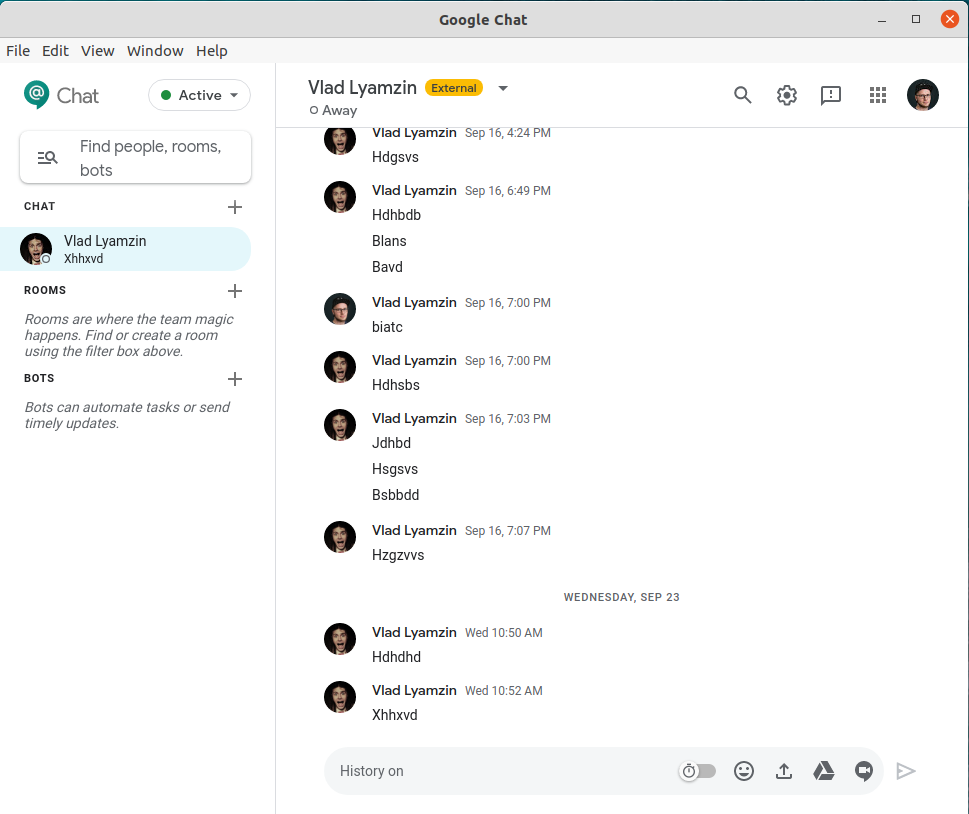

# Google Chat - Desktop



This is unofficial web wrapper for Google Chat. It brings the ability to run standalone application for users who don't use Google Chrome. 

Google Chat Desktop available on all platforms - Linux, Mac & Windows, and brings additional functionality which is missed in Chat web application.

## Installation
1. Go to Release page and get DEB/RPM/DMG/EXE package
2. For Linux systems there is also an option to use AppImage package

## Build Instructions

1. Make sure you have Node and NPM installed:
    ```
    $ node -v
    $ npm -v
    ```
2. Clone the repo
3. Install all dependencies by running
    ```
    $ make install
    ```
4. Run the app from project root directory by:
    ```
   $ make start
   ```

## Packaging Information

To package the apps for each platform:

```
$ make build-rpm        // for Fedora/CentOS/RHEL/SuSE
$ make build-dev        // for Debian/Ubuntu and derivatives
$ make build-pacman     // for Arch/Manjaro and derivatives
$ make build-linux      // for AppImage
$ make build-mac        // for Mac OS .dmg file
$ make build-win        // for Windows .exe file
```
